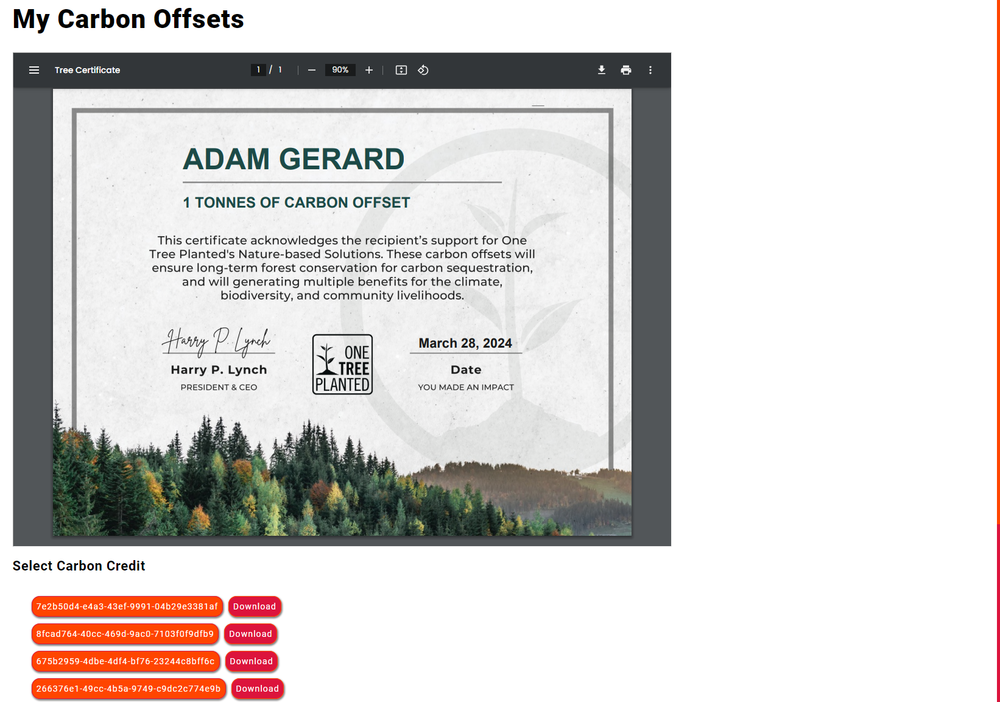
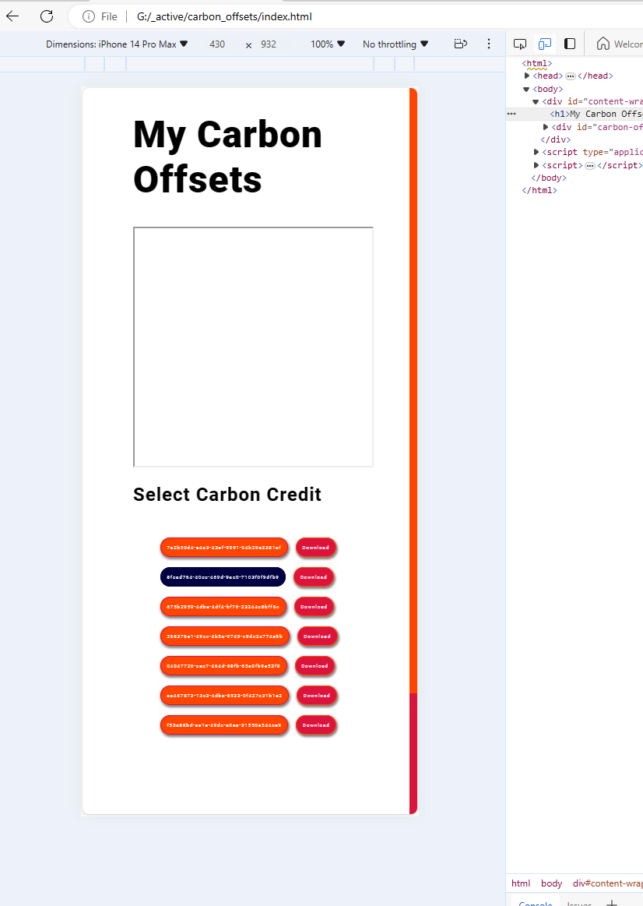
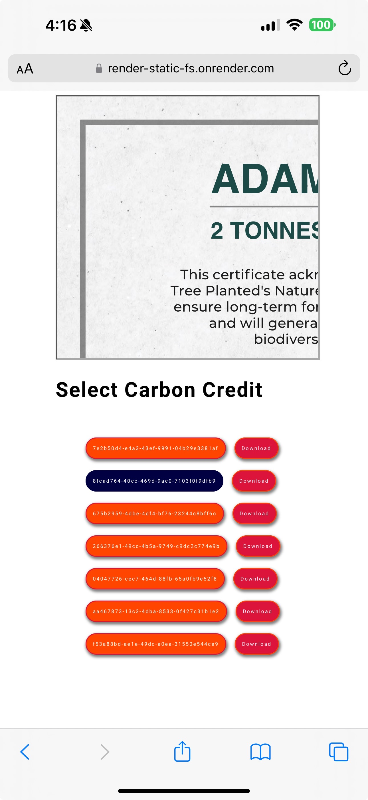

# carbon_offsets

[](https://developer.mozilla.org/en-US/docs/Web/HTML/Element/iframe)

Just a fun page to track and host my carbon offsetting/credits.

> **Update:** I was invited to apply with this to a Startup Incubator recently (to be further developed into a Company/Product) but declined due to a lack of direct experience in that industry. (And, not out of interest! Greenwashing is a major challenge to help derisk the Decarbonization Industry.) 

Also, wanted to test the following:

1. I was unaware that `iframes` could be modified *after being rendered*. Curious about how the `iframe` and `pdfviewer` interact on the page. I use them [here](https://www.thoughtscript.io/blog/000000000093) and [elsewhere](https://www.thoughtscript.io/papers/000000000006) but the *content is fixed* and *doesn't change once rendered*. 
1. Identifying and playing with some limits to testing `iframes`. For instance, using the Browser-based **Web Inspector** on Desktop will fail to correctly render the changing `iframe src`. However, when deployed to a host, the changes appear correctly. 
   
   i. This appears to be the case regardless of Browser/vendor.  
   ii. Not sure if that has to do with some shared PDF rendering tools/engine?  
   iii. (*I find PDF, Markdown, Parsing, and Text Rendering to be interesting topics - for instance: https://www.thoughtscript.io/ is a **Statically Generated Blog Framework***)

2. To better document my Net-Zero Carbon journey! I've been slowly amassing some certificates and want to host them and prove I'm going Net-Zero Carbon.
3. To better understand the differences in how browsers render injected PDF files. 
   
   i. For instance, **Microsoft Edge** `Version 124.0.2478.51 (Official build) (64-bit)` renders the corresponding **DOM Element** as:

    ```html
    <div id="document-container">
    <div id="embed-border" style="top: 41px; height: 3555px; width: 4796px;"></div>
    <embed id="plugin" type="application/x-google-chrome-pdf" original-url="file:///G:/_active/carbon_offsets/carbon_offsets/8fcad764-40cc-469d-9ac0-7103f0f9dfb9.pdf" src="chrome-extension://mhjfbmdgcfjbbpaeojofohoefgiehjai/f22cfdd5-f4f1-484c-8668-6add08531e70" background-color="0xFFE6E6E6" first-page-separator="4" style="position: relative !important; top: 41px; min-height: calc(100% - 41px);" javascript="allow" stream_timestamp="7457857329" embed-top-offset="41" width="785" height="612" top-level-url="file:///G:/_active/carbon_offsets/index.html" pdfviewrecoveryenabled="" pdffreetextenabled="" data-docheight="826" data-docwidth="1066"></div>
    ```

   ii. In **Brave** `1.65.114` however:

    ```html
    <pdf-viewer id="viewer">
        <!-- ... -->
    </pdf-viewer>
    ```

   iii. Surprised that these differ so much but yet display the same test rendering issues.
 
## Tests

Per point **2.** above:

1. Desktop with Browser-based **Web Inspector** performs as expected - rendering each update correctly. The `iframe` appears as a `pdfviewer`:

    

1. Desktop with Browser-based **Web Inspector** doesn't perform as expected when emulating an `iPhone 14 Pro Max` - the clickable selections don't rerender correctly:


1. However, the same deployment renders each change correctly on an actual `iPhone 14 Pro Max`:

    


> Interesting limitation of Browser Web Inspectors and Desktop emulation.
